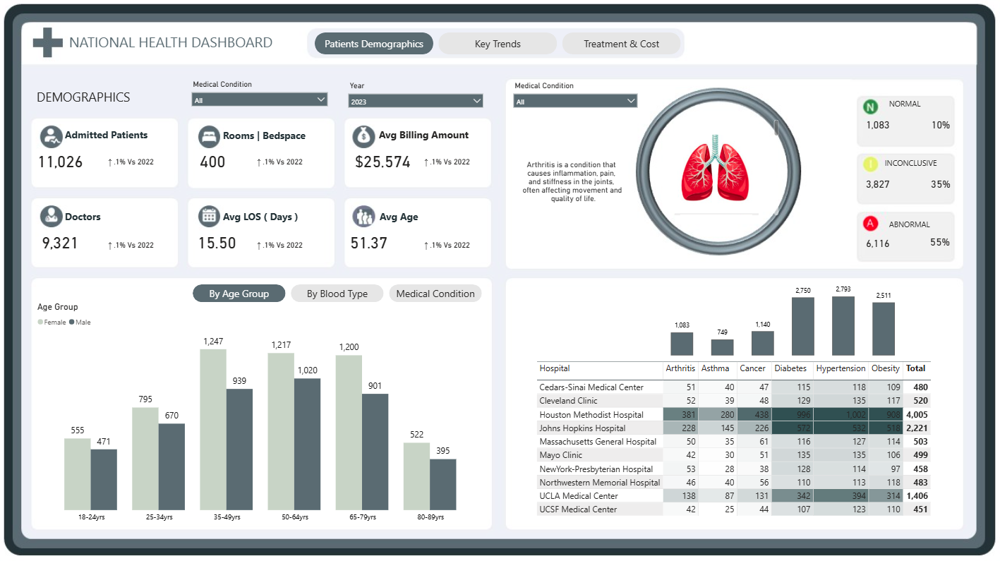

# Healthcare Data Analysis Dashboard - Power BI Project 
##### [Live Dashboard](https://app.powerbi.com/view?r=eyJrIjoiNTk5OGNlZjktOTliYi00MjY2LThhYzUtYTgyYTBiNzA3OTk1IiwidCI6ImUxMjJlZTIwLTQ5MWItNDM3ZS05NmMwLTEzZGM3OTE3ODk2OSIsImMiOjN9 )

## Project Overview

This project showcases the development of a comprehensive and interactive Power BI dashboard for healthcare data analysis. Leveraging a detailed dataset of patient records, the dashboard provides critical insights into patient demographics, medical conditions, financial performance, and operational efficiency within a healthcare setting. The aim is to enable healthcare stakeholders (e.g., hospital administrators, financial officers, medical directors) to make data-driven decisions.

## Table of Contents

1.  [Project Overview](#project-overview)
2.  [Dataset](#dataset)
3.  [Key Project Phases & Techniques](#key-project-phases--techniques)
    * [Data Ingestion & Understanding](#data-ingestion--understanding)
    * [Advanced Data Preparation & Transformation](#advanced-data-preparation--transformation-power-query-editor)
    * [Robust Data Modeling](#robust-data-modeling-star-schema-implementation)
    * [Key Performance Indicators (KPIs) & Advanced DAX Measures](#key-performance-indicators-kpis--advanced-dax-measures)
    * [Interactive Dashboard Design & Advanced Visualizations](#interactive-dashboard-design--advanced-visualizations)
4.  [Key Findings & Insights](#key-findings--insights)
5.  [Tech Stack](#tech-stack)
6.  [Recommendations](#recommendations)
7.  [Future Enhancements](#future-enhancements)

## Dataset

The analysis is based on a simulated healthcare dataset containing the following key information:

* **Patient Demographics:** Age, Gender, Blood Type
* **Medical Information:** Medical Condition, Date of Admission, Doctor, Discharge Date, Medication, Test Results
* **Hospital & Financial Data:** Hospital Name, Insurance Provider, Billing Amount, Room Number, Admission Type, Hospital Latitude, Hospital Longitude
## Tech Stack

* **Data Source:** CSV (Comma Separated Values)
* **Data Analysis & Visualization Tool:** Microsoft Power BI Desktop
* **Data Transformation:** Power Query (M Language)
* **Data Modeling & Calculations:** DAX (Data Analysis Expressions)

## Key Project Phases & Techniques

This project demonstrates a robust understanding of Power BI's capabilities, covering:

### Data Ingestion & Understanding

* Imported raw CSV data (`Healthcare Analysis Dataset.csv`) into Power BI.

### Advanced Data Preparation & Transformation (Power Query Editor)

* **Data Type Management:** Ensured optimal data types for all columns.
* **Feature Engineering:** Created calculated columns such as `Length of Stay` (derived from `Discharge Date` - `Date of Admission`) to generate new analytical metrics.

### Robust Data Modeling (Star Schema Implementation)

* **Dedicated Date Table:** Created and integrated a canonical `Date Table` (using DAX's `CALENDAR` function) and linked it to the main data via `Date of Admission` for robust time-intelligence capabilities.
* **Dataset Normalization:** Transformed the initial flat file into a Star Schema for improved performance, data integrity, and scalability. This involved:
    * Creating a `MedicalCondition Dimension` table (a dimension table containing unique medical conditions and a `MedicalConditionID`).
    * Refactoring the main data into a `Healthdata` Fact table, where the `Medical Condition` text was replaced by `MedicalConditionID` as a foreign key.
* **Relationship Management:** Established clear one-to-many relationships between the Fact and Dimension tables (e.g., `Healthdata` to `MedicalCondition Dimension` via `MedicalConditionID`, and `Healthdata` to `Date Table` via `Date of Admission`).

### Key Performance Indicators (KPIs) & Advanced DAX Measures

Developed a comprehensive set of DAX measures to quantify performance, track trends, and provide granular insights. These measures are the backbone of the dashboard's analytical power:

* **Core Performance Measures:**
    * `Admitted Patients`: `DISTINCTCOUNT(HealthData[Patient ID])` - Total unique patients admitted.
    * `Avg LOS`: `AVERAGE(HealthData[Length of Stay])` - Average length of stay for patients.
    * `Avg Billing Amt`: `AVERAGE(HealthData[Billing Amount])` - Average billing amount per patient.
    * `Doctors`: `DISTINCTCOUNT(HealthData[Doctor])` - Total unique doctors involved.
    * `Rooms`: `DISTINCTCOUNT(HealthData[Room Number])` - Total unique room numbers utilized.
    * `Average age`: `AVERAGE(HealthData[Age])` - Average age of admitted patients.
    * `Total Billing`: `SUM(HealthData[Billing Amount])` - Overall total billing generated.

* **Year-over-Year (YoY) Growth Measures:** These measures dynamically calculate percentage change against the previous year for key metrics, providing trend analysis (utilizing `CALCULATE`, `SELECTEDVALUE`, `ISBLANK`, `DIVIDE`, and `FORMAT` functions with 'Calendar' table for context):
    * `Adm YoY`: Year-over-Year change in `Admitted Patients`.
    * `Doc YoY`: Year-over-Year change in `Doctors` count.
    * `Room YoY`: Year-over-Year change in `Rooms` utilized.
    * `Bill YoY`: Year-over-Year change in `Avg Billing Amt`.
    * `LOS YoY`: Year-over-Year change in `Avg LOS`.
    * `Age YoY`: Year-over-Year change in `Average age`.

* **Test Results Distribution Measures:**
    * `Normal Results`: `CALCULATE([Admitted Patients], HealthData[Test Results] = "Normal")` - Count of patients with normal test results.
    * `Normal Result %`: `DIVIDE([Normal Results],[Admitted Patients],0)` - Percentage of patients with normal test results.
    * `Abnormal Results`: `CALCULATE([Admitted Patients], HealthData[Test Results] = "Abnormal")` - Count of patients with abnormal test results.
    * `AbnormalR %`: `DIVIDE([Abnormal Results], [Admitted Patients],0)` - Percentage of patients with abnormal test results.
    * `Inconclusive Results`: `CALCULATE([Admitted Patients], HealthData[Test Results] = "Inconclusive")` - Count of patients with inconclusive test results.
    * `Inconclusive %`: `DIVIDE([Inconclusive Results], [Admitted Patients],0)` - Percentage of patients with inconclusive test results.

* **Dynamic Title Measures:**
    * `Title`: Dynamically generates a title for visuals, e.g., "Total Billing Accumulated by [Selected Medical Condition]".
    * `Line Title`: Dynamically updates a line chart title based on user selection, indicating the currently viewed trend (e.g., "Currently Viewing Admitted Patients Trend").

### Interactive Dashboard Design & Advanced Visualizations

* **Strategic Layout:** Designed a multi-page dashboard structure to guide users through an analytical narrative, starting from an executive overview to granular deep dives.
* **Diverse Visualizations:** Utilized a wide array of Power BI visuals to present data effectively:
    * **KPI Cards:** For immediate overview of key metrics.
    * **Bar/Column Charts:** To compare categorical data (e.g., patients by admission type, billing by hospital/medical condition).
    * **Line Charts:** For temporal trends (e.g., medication count over time).
    * **Donut Charts:** To show composition (e.g., test result distribution).
    * **Stacked Bar Charts:** To visualize proportions within categories (e.g., average age by blood type with test result breakdown).
   <!--- * **Geospatial Analysis:** Leveraged `Hospital Latitude` and `Hospital Longitude` for geographical insights (e.g., Billing Amount by Hospitals). ---> 
* **Leveraging Images:** Integrated medical condition images into the `MedicalCondition Dimension` table and displayed them within the dashboard to enhance visual engagement and user understanding.
* **Enhanced Interactivity:** Implemented features such as synchronized slicers, drill-through functionality, and custom report page tooltips to provide a dynamic and user-friendly exploration experience.
* **Conditional Formatting:** Applied rules to visuals to highlight critical data points, trends, drawing immediate attention to key insights.

## Key Findings & Insights

The dashboard revealed several actionable insights critical for various healthcare stakeholders:

* **Operational Efficiency (Admissions & Length of Stay):**
    * **Emergency admissions are the dominant intake method**, highlighting the critical importance of emergency services and related resource allocation.
    * An abrupt drop in the **count of medications per discharge in late 2024** was identified as a significant outlier, warranting immediate investigation into data quality, new treatment protocols, or changes in patient profiles.
* **Patient Health & Clinical Outcomes:**
    * **Asthma, Diabetes, and Obesity are the most prevalent medical conditions** by patient count, emphasizing the need for focused chronic disease management programs.
    * A **significant majority of medical conditions are associated with 'Abnormal' test results**, indicating potential underlying health issues or complex patient cases that require clinical attention. This proportion remains consistent across different hospital locations.
* **Financial Performance:**
    * **"Hou. Med" (likely Houston Medical) generates a disproportionately high billing amount**, significantly outweighing other hospitals. This indicates it as a major revenue center, prompting further analysis into its patient volume, service mix, or pricing strategies.
    * While high-volume conditions like Diabetes and Asthma are common, **Cancer is the highest revenue-generating medical condition**, reflecting the high cost and complexity of its treatments.

## Recommendations

Based on the dashboard's findings, the following recommendations are put forth for stakeholders:

* **For Hospital Administrators & Operational Managers:**
    * **Optimize Emergency Services:** Given the high volume of emergency admissions, conduct a deeper analysis to understand peak times, common conditions, and resource bottlenecks to enhance efficiency and patient throughput.
    * **Investigate Medication Outlier:** Immediately probe the sharp decline in medication count towards late 2024 to ascertain if it's a data quality issue, a shift in clinical practice, or incomplete data reporting.
* **For Financial Officers & Billing Departments:**
    * **Analyze "Hou. Med" Success:** Conduct a detailed comparative analysis of "Hou. Med"'s operations, patient mix, and billing practices to identify transferable strategies that could boost revenue in other facilities.
    * **Strategic Financial Planning for Cancer Care:** Given Cancer's high billing contribution, assess cost-efficiency, resource allocation, and potential for expanding high-value services within oncology.
* **For Medical Directors & Quality Assurance:**
    * **Prioritize Chronic Disease Management:** Allocate increased resources and develop specialized programs for Asthma, Diabetes, and Obesity due to their high prevalence.
    * **Deep Dive into Abnormal Test Results:** Investigate the specific medical conditions most frequently associated with 'Abnormal' test results to identify areas for improving diagnostic accuracy, treatment efficacy, or patient education.

## Future Enhancements

* Exploring advanced geospatial visualizations for patient origin or disease spread.
* Integrating external benchmarks or targets for performance comparison.
* Developing custom visual interactions using Power BI's advanced features and potentially Python/R scripting.

## Acknowledgements

Special thanks to **Efasa Okeh** for his insightful tutorials and guidance that contributed to the development of this project.

## License

This project is licensed under the MIT License.
